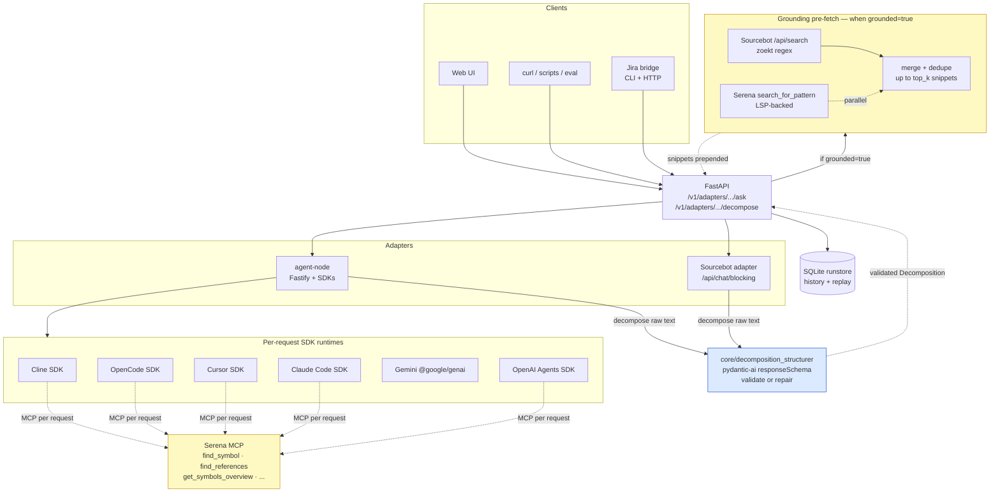

<div align="center">

  <p>
    
    
    
    
    
  </p>
  <p>
    
    
    
    
    
    
    
  </p>

  <h1>tech-decomposition</h1>
  <p align="center">
    One JSON API. Seven code-AI backends. Two modes (ask, decompose).<br/>
    Optional grounded retrieval, augmented with LSP-backed semantic search via Serena MCP.<br/>
    Schema-bulletproof decompose output. A web UI, an eval harness, and a
    drop-in Jira integration to file decompositions as comments.
  </p>

  <p>
    <a href="#results">Results</a> ·
    <a href="#what-it-is">What it is</a> ·
    <a href="#adapters">Adapters</a> ·
    <a href="#http-api">HTTP API</a> ·
    <a href="#decompose-pipeline">Decompose pipeline</a> ·
    <a href="#grounded-retrieval-opt-in">Grounding</a> ·
    <a href="#serena-mcp-optional">Serena</a> ·
    <a href="#jira-bridge">Jira bridge</a> ·
    <a href="#web-ui">UI</a> ·
    <a href="#quick-start">Quick start</a>
  </p>

</div>

---

## Results

Every number below is from the eval harness in [`eval/`](eval/) running real
questions from production Slack channels against the actual codebase (5 git
repos, ~1.2M LOC), scored by a deterministic rubric (`must_mention`
substrings) plus a Gemini Flash LLM-judge against hand-written gold answers.

### Decompose — all 6 adapters round-tripped end-to-end

Verified on a real Jira ticket (SCRUM-18, "Move Traceability Static Validation to Cloud Function") via the [Jira bridge](#jira-bridge). Each adapter fetched the ticket, ran decompose through the [structurer pipeline](#decompose-pipeline), and posted a clean ADF comment back:

| Adapter | Driving model | Subtasks | Wall |
|---|---|---|---|
| `cursor` | composer-2 | 4 | 59 s |
| `gemini` | gemini-2.5-pro | 2 | 59 s |
| `cline_sdk` | gemini-2.5-pro | 4 | 77 s |
| `opencode` | google/gemini-2.5-pro | 6 | 35 s |
| `sourcebot` | gemini-2.5-pro (via /api/chat/blocking) | 4 | 62 s |
| `openai_agents` | gpt-4o-mini | 1 | 33 s |

Every comment was a fully-rendered Decomposition with overview, affected repos, subtasks with files + acceptance criteria, risks, and open questions — schema-bulletproof, validated by the shared structurer regardless of the adapter's native output shape.

For quality comparison against a hand-grounded reference, see
[`docs/grounded-eval/scrum18/`](docs/grounded-eval/scrum18/) — same ticket,
graded against an expert-written gold answer. Spoiler: Cursor leads
(34/40 vs 7/40 for the original pre-fix Gemini run), but the gap is now
mostly about depth of exploration, not foundational adapter brokenness.

### Ask — best result, full bake-off

5 hand-curated questions × 5 adapters × 2 modes, scored by rubric + LLM-judge:

| Recommended config | Score |
|---|---|
| **`cursor` ungrounded** (default) | **0.773** |
| `gemini` ungrounded (agentic, strong prompt) | 0.677 |
| `cursor` grounded — for enumeration questions only | 0.731 (and 0.984 on `q-user-roles` specifically) |

Everything else trails. Cline_sdk and OpenCode both scored in the 0.26–0.48 range and showed high run-to-run variance (Cline swung 0.79 on the same question across two runs). Sourcebot's own chat scored 0.45.

Per-question pattern that emerged:

| Question pattern | What works |
|---|---|
| Bounded symbol lookup (`q-jwt-stateless`, `q-geojson-country-check`) | Cursor / Gemini ungrounded, both hit 1.0 |
| Enumeration ("list all X" — `q-user-roles`) | Cursor **grounded** (0.984) |
| Behavior trace | Gemini ungrounded (1.0 on `q-data-sharing-geolocation` from 3-case eval) |
| Validator/regex lookup (`q-farm-name-unicode`) | **Nothing works yet.** Every adapter 0.10–0.46. Real product gap. |

Three things drove those numbers:

1. **Forced tool use for Gemini.** The default `_ASK_SYSTEM` prompt told Gemini that tools "were available." Gemini ignored them — ~1 call per question, answers from training knowledge. The new prompt makes tool use *mandatory* with a 3-step workflow. Tool calls jumped from 1 → 7.67 per case. Score 0.64 → 0.79.

2. **Serena MCP** wired into every adapter that supports MCP — Cursor, Claude Code, Cline, OpenCode, OpenAI Agents. Cline + OpenCode actually *use* Serena's LSP-backed tools (`find_symbol`, `search_for_pattern`, `find_referencing_symbols`); Cursor's Composer-2 and gpt-4o-mini saw the tools but never called them. The model matters more than the tools.

3. **Serena as a grounding source.** For adapters that can't take MCP themselves (Gemini direct, Sourcebot's `/api/chat`), the grounding pipeline now runs Sourcebot search AND Serena search in parallel and merges the snippets.

**What didn't pan out (recorded honestly):**

- **Grounding is not a useful default.** Pre-fetched snippets make the model trust the first hit and stop investigating, which catastrophically fails on enumerative and trace questions (Gemini dropped 1.0 → 0.148 on `q-geojson-country-check` when grounded). Default is `grounded=false`. Flip on per-request for enumeration questions or for OpenCode specifically.
- **Cursor (Composer-2) ignored Serena.** It listed Serena's 28 tools every request but never called one. Wiring is in place for free if a future Cursor model changes that.
- **The regex/validator pattern is unsolved.** None of the adapters, grounding, MCP, or prompt tricks moved `q-farm-name-unicode` above 0.46.

---

## What it is

A thin **uniform contract** over a handful of code-AI tools — Claude Code, Cursor, Cline, Gemini, OpenAI Agents, OpenCode, and Sourcebot. Same JSON request shape, same response shape, regardless of which one runs it. Two modes:

- **`ask`** — code Q&A. The adapter explores the workspace (each SDK uses its own tools) and answers.
- **`decompose`** — turn a ticket / task into a typed `Decomposition`: overview, affected repos, subtasks (with files + acceptance criteria), risks, open questions.

You drive it via FastAPI (`/v1/adapters/{name}/{ask,decompose}`) or the bundled React UI. Swap adapters per request. Run the same input through several at once (`/v1/bakeoff/{job}`) and compare. Optionally pre-fetch Sourcebot-indexed snippets as a grounding step.

That's the whole project. Nothing else hides under the hood.

---

## Adapters

Registered in `src/tech_decomposition/adapters/registry.py`. Most SDK-backed adapters run inside `services/agent-node` (Node, Fastify) — the Python side is a thin HTTP client. `sourcebot` is the exception: it's a Python adapter that talks directly to Sourcebot's `/api/chat/blocking` endpoint.

| Adapter | Backend | Runtime | `ask` | `decompose` | Serena MCP |
|---|---|---|:-:|:-:|---|
| **`cursor`** | [`@cursor/sdk`](https://www.npmjs.com/package/@cursor/sdk) | Node | ✅ | ✅ | per-request* |
| **`gemini`** | [`@google/genai`](https://www.npmjs.com/package/@google/genai) | Node | ✅ | ✅ | via grounding |
| **`sourcebot`** | Sourcebot `/api/chat/blocking` | Python | ✅ | ✅ | via grounding |
| **`cline_sdk`** | [`@cline/sdk`](https://www.npmjs.com/package/@cline/sdk) | Node | ✅ | ✅ | **per-request ✓** |
| **`opencode`** | [`@opencode-ai/sdk`](https://opencode.ai/) | Node | ✅ | ✅ | **per-request ✓** |
| **`openai_agents`** | [`@openai/agents`](https://github.com/openai/openai-agents-js) | Node | ✅ | ✅ | per-request* |
| **`claude_code`** | [`@anthropic-ai/claude-agent-sdk`](https://www.npmjs.com/package/@anthropic-ai/claude-agent-sdk) | Node | ✅ | ✅ | per-request | host-only — Docker arm64-musl native binary doesn't launch |

\* Wired but the underlying model (Composer-2 / gpt-4o-mini) doesn't call MCP tools in measurements so far. Cline (Gemini Pro driving) and OpenCode (Gemini Pro driving) do call them and benefit.

**Verified end-to-end** — all 6 working decompose adapters fanned through the [Jira bridge](#jira-bridge) against the same ticket and posted clean comments back. Browse SCRUM-18 in our internal Jira to see the side-by-side.

Each Node-side adapter exposes the SDK's own workspace tools (`read_file`, `list_directory`, `grep_search`, `search_files`) so its agent can explore your local clones at `REPOS_ROOT`. When `SERENA_URL` is set, Cursor / Claude Code / Cline / OpenCode / OpenAI Agents get Serena's tools registered automatically over MCP; Gemini and Sourcebot (which can't take MCP) get Serena via the grounding step instead.

Discover what's installed + healthy at runtime:

```http
GET /v1/adapters
```

---

## HTTP API

| Method | Path | Purpose |
|---|---|---|
| `GET` | `/health` | Liveness |
| `GET` | `/v1/adapters` | List adapters, capabilities, health |
| `POST` | `/v1/adapters/{name}/ask` | Code Q&A through one adapter |
| `POST` | `/v1/adapters/{name}/decompose` | Ticket → `Decomposition` |
| `POST` | `/v1/grounding/retrieve` | Sourcebot search alone — see snippets + metrics |
| `POST` | `/v1/bakeoff/{job}` | `ask`\|`decompose` — fan one input across N adapters |
| `GET` | `/runs`, `/runs/{id}` | History list / detail |
| `POST` | `/runs/{id}/replay` | Re-run a saved request |

**Request example (ask, grounded):**

```bash
curl -sS http://localhost:18000/v1/adapters/cursor/ask \
  -H 'content-type: application/json' \
  -d '{"query":"how does upload master data work?","grounded":true}' \
  | jq '{adapter: .result.adapter, snippets: (.result.grounding.snippets|length), tokens: .result.metrics.tokens_in}'
```

**Response shape (ask):**

```json
{
  "run_id": "ab12...",
  "thread_id": "ab12...",
  "result": {
    "adapter": "cursor",
    "answer": "...",
    "citations": [],
    "metrics": { "tokens_in": 8200, "tokens_out": 410, "duration_ms": 7400, "model": "composer-2", ... },
    "grounding": {
      "snippets": [{ "repo": "...", "path": "...", "start_line": 23, "end_line": 47, "content": "...", "url": "..." }],
      "grounding_block": "## Relevant code (grounded retrieval)\n...",
      "metrics": { "duration_ms": 850, "snippet_count": 6, "total_chars": 14200, "sources": ["sourcebot"], "sourcebot_files_seen": 6 }
    }
  }
}
```

`result.grounding` is only present when the request set `grounded: true`.

---

## Decompose pipeline

Three layers, one responsibility each. This is what makes decompose
output schema-bulletproof regardless of which adapter you point it at.

```mermaid
flowchart LR
  IN[POST /v1/adapters/{name}/decompose] --> A
  A[Adapter._decompose_raw_text<br/>drive its LLM, return text + metrics] --> B
  B[core/decomposition_structurer<br/>validate or repair via pydantic-ai] --> C
  C[Decomposition.to_markdown<br/>render Jira/Linear-ready markdown] --> OUT[AdapterDecomposeResult]
```

1. **Adapter** ([`adapters/_*.py`](src/tech_decomposition/adapters/)) — drives its
   LLM via the SDK (Cursor, Gemini, Cline, OpenCode, Claude Code, OpenAI
   Agents) or chat endpoint (Sourcebot). Returns just `{ text, metrics }` —
   no JSON parsing, no schema validation, no Decomposition construction.
   That's the whole adapter contract for decompose.

2. **Structurer** ([`core/decomposition_structurer.py`](src/tech_decomposition/core/decomposition_structurer.py)) —
   normalises the upstream text into a validated `Decomposition` object.
   Two paths:
   - **Fast path**: `Decomposition.model_validate_json(text)` directly, with
     ```json fence-stripping. Fires when the adapter's LLM already emitted
     a schema-valid JSON (Gemini with `responseSchema`, OpenCode with its
     own structured output, etc.).
   - **Slow path**: pydantic-ai with `output_type=Decomposition` calls
     Gemini Flash (configurable via `enrich_model`). Gemini's
     `responseSchema` API forces the model to emit a schema-valid object
     — used for free-form upstream (Cursor, Cline, prose-y Sourcebot
     chat). Cost ~$0.0001, ~1–2s.

3. **Renderer** ([`Decomposition.to_markdown()`](src/tech_decomposition/models.py)) —
   the validated Decomposition is rendered as Jira/Linear/GitHub-ready
   markdown for the `result.markdown` field and the UI's "Raw markdown"
   panel. Mirrors the web UI's `toJiraMarkdown` helper so the rendered
   panel and the "Copy Markdown" / "Copy Jira body" buttons emit
   identical text.

**Telemetry** for each call is in `result.metrics.extra`:
`structurer_used_llm_repair` (which path fired), `structurer_model`,
`upstream_raw_text` (4 KB cap, for debugging when the upstream emitted
something weird), and for Gemini specifically `tool_trace` (every
workspace tool call name + args + result preview + latency).

Why this matters: adapters can ship bare Subtask objects, markdown-fenced
JSON, free prose, or anything in between — the pipeline normalises every
shape to a guaranteed-valid `Decomposition` before it leaves the API.
No 502s on malformed model output.

---

## Grounded retrieval (opt-in)

Grounding is a **single composable step**, not a default. You ask for it per request:

- **As a standalone call**: `POST /v1/grounding/retrieve` returns the snippets, the rendered markdown block, and timing/char metrics — no LLM call. Useful to see *what* grounding produces and *what it costs* before deciding to inject it.
- **As a flag on ask**: `POST /v1/adapters/{name}/ask` with `{"grounded": true}` runs the same retrieval, prepends the block to the user prompt, then calls the adapter. The adapter's `metrics` (tokens/cost) and `grounding.metrics` (latency/snippets/chars) are reported separately so you can compare grounded vs not on the same question.

**Two parallel sources** (when both are configured):

1. **Sourcebot `/api/search`** — zoekt-style regex search across all indexed repos. Returns chunked file matches with surrounding context lines. Picks the LLM Sourcebot's chat uses from `config/sourcebot/config.json`.
2. **Serena `search_for_pattern`** — LSP-backed semantic search via MCP. Adds structured matches that complement Sourcebot's regex hits. Only runs when `SERENA_URL` is set; degrades silently otherwise.

The two sources fan out in parallel, are deduped by file path, and merged up to `top_k` snippets. `GroundingMetrics` reports `sourcebot_files_seen` and `serena_hits` separately so you can see which source contributed what.

### Default: leave grounding off

The 5-case bake-off (see [eval/outputs/bakeoff-20260518T134739Z/](eval/outputs/bakeoff-20260518T134739Z/)) settles this empirically: the **best single result** is **`cursor` ungrounded at 0.773**. Grounding helps on one specific question pattern (enumeration — "list all X") and hurts on everything else, sometimes catastrophically (Gemini dropped 1.0 → 0.148 on `q-geojson-country-check` when grounded).

| Adapter | Avg ungrounded | Avg grounded | Verdict |
|---|---|---|---|
| `cursor` | **0.773** | 0.731 | Default off. Flip on per-request for enumeration questions (`q-user-roles`-style). |
| `gemini` | **0.677** | 0.428 | Default off. Grounding consistently hurts. |
| `sourcebot` | 0.450 | 0.384 | No agent loop — grounding can't make it worse than its own chat. Leave on. |
| `cline_sdk` | 0.263–0.453 (noisy) | 0.301–0.483 (noisy) | Either way; high run-to-run variance, judge case-by-case. |
| `opencode` | 0.275 | **0.406** | Default on. Grounding helps this adapter on average. |

**Bottom line for callers**: `grounded` is already `false` by default on `AdapterAskInput`. Don't change that. The two exceptions worth a `grounded=true` request are: any adapter on an enumeration question, and OpenCode in general.

What grounding does **not** include (vs. the v0 pipeline that was removed):

- No ChromaDB / Sentence Transformers local index
- No tree-sitter repo map / structural prelude
- No reranker

Reason: each SDK adapter has its own retrieval inside its agent loop. Adding our own embedding store on top adds latency without proportional gain — Serena's LSP-backed lookups subsume what those layers were going to provide, and are scoped to the adapters that actually benefit.

---

## Serena MCP (optional)

[Serena](https://github.com/oraios/serena) is an LSP-backed MCP server that
exposes semantic code tools (`find_symbol`, `find_references`,
`get_symbols_overview`, `search_for_pattern`, ...) that go beyond plain
grep. When `SERENA_URL` is set in `.env`, two things happen automatically:

1. **Per-request MCP wiring** for Cursor, Claude Code, Cline, OpenCode, and
   OpenAI Agents — Serena's tools are registered alongside the SDK's
   native workspace tools so the agent can call them as it explores.
2. **Grounding augmentation** for Gemini direct and Sourcebot (the two
   adapters whose runtimes don't accept MCP) — Serena
   `search_for_pattern` is fanned out per term in parallel with Sourcebot
   and the results are merged into the snippet block.

Run Serena out-of-band:

```bash
uvx --from git+https://github.com/oraios/serena serena start-mcp-server \
  --transport streamable-http --port 9121 --context agent \
  --project "$REPOS_ROOT"

# in .env:
SERENA_URL=http://localhost:9121/mcp           # host agent-node
# or:
SERENA_URL=http://host.docker.internal:9121/mcp  # docker agent-node
```

Leave `SERENA_URL` unset to skip Serena entirely — every adapter falls back
to its prior behavior.

---

## Jira bridge

Self-contained sibling service at [`services/jira-bridge/`](services/jira-bridge/) — takes a Jira ticket key, runs it through `/v1/adapters/{name}/decompose`, posts the result back as an ADF-formatted comment on the same ticket. Two interfaces, one shared flow ([`decompose_ticket.ts`](services/jira-bridge/src/decompose_ticket.ts)):

```bash
# CLI (one-off / scripting):
cd services/jira-bridge
cp .env.example .env  # fill JIRA_BASE_URL, JIRA_EMAIL, JIRA_API_TOKEN
npm install
npm run cli -- TRT-123 TRT-456    # one or more ticket keys

# HTTP (for Jira automation rules / Slack shortcuts):
npm run dev    # tsx watch on :13200
curl http://localhost:13200/run \
  -H 'content-type: application/json' \
  -H "authorization: Bearer $JIRA_BRIDGE_SHARED_SECRET" \
  -d '{"key":"TRT-123"}'
```

Output per ticket:

```
→ TRT-123: fetching + decomposing…
  ok: 5 subtasks across 2 repos, cursor/composer-2, 42.1s
  comment: https://yourcompany.atlassian.net/browse/TRT-123?focusedCommentId=…
```

**Adapter selection** is a single env var: `TECH_DECOMP_ADAPTER=cursor` (or any of `gemini`, `cline_sdk`, `opencode`, `sourcebot`, `openai_agents`, `claude_code` if working on your host). All six decompose-capable adapters have been verified end-to-end through the bridge.

**Comment shape** is real ADF (Atlassian Document Format): paragraphs, headings, bullet lists, file paths in monospace, links you can click. No raw-markdown blob. The renderer is [`src/adf.ts`](services/jira-bridge/src/adf.ts).

**No imports from outside** `services/jira-bridge/` — designed to lift into its own repo whenever the integration outgrows being a sibling. The bridge README documents the move.

Slack is intentionally out of scope for now. The flow object in `decompose_ticket.ts` is already shaped to feed a Slack notification step if you add one later.

---

## Web UI

A React + Tailwind + DaisyUI single-page app under [`web/`](web/). Two tabs:

- **Ask** — chat-style threaded conversation. Pick adapter, optionally toggle **Grounded**, send. The answer card shows the meta strip (model, wall, tokens, cost), the markdown answer, citations, and (when grounded) a collapsible grounding panel that lists each injected snippet inline.
- **Decompose** — single-shot ticket → structured `Decomposition`. Renders subtasks as cards (title, repo, complexity badge, files with optional Sourcebot URLs, acceptance criteria) plus collapsible risks / open questions, with raw markdown tucked at the bottom.

History sidebar covers both modes. Click any prior run to see its details (including its grounding payload if it had one).

```bash
cd web && npm install && npm run dev   # → http://localhost:15173, vite proxies API to :18000
```

For prod the UI is bundled with `npm run build`; FastAPI serves `web/dist/` at `/ui` when present.

---

## Architecture



- The **structurer** (blue) is the schema-bulletproof layer for decompose: every adapter just produces text; the structurer guarantees a valid `Decomposition` via pydantic-ai + Gemini's `responseSchema`. See [Decompose pipeline](#decompose-pipeline).
- **Grounding** (yellow, left) runs only when the request sets `grounded=true`; degrades to Sourcebot-only when Serena isn't configured.
- **Serena MCP** (yellow, right) is wired into the tool-using adapters only when `SERENA_URL` is set.
- **Jira bridge** is a sibling Node service that posts a decompose result back as an ADF comment on the same ticket. See [Jira bridge](#jira-bridge).

Without grounding/Serena, the path is straight: API → adapter → SDK → LLM → text → structurer → Decomposition → runstore.

---

## Repo layout

```text
src/tech_decomposition/
├── adapters/                          # 7 adapters + registry + Decomposition prompt helpers
│   ├── base.py                        #   Adapter contract; decompose() is final + calls structurer
│   ├── _cursor_sdk.py / _gemini.py / _cline_sdk.py / _opencode_sdk.py
│   ├── _claude_code_sdk.py / _openai_agents.py / _sourcebot.py
│   └── _prompts.py                    #   DECOMPOSE_PREAMBLE + query_blob
├── clients/sourcebot.py               # Sourcebot HTTP client (chat/blocking + answer-style suffix)
├── core/
│   ├── decomposition_structurer.py    # ← the schema-bulletproof layer
│   ├── grounding.py                   # GroundedContext + retrieve_grounded_context()
│   ├── serena_client.py               # MCP streamable-HTTP client for Serena grounding source
│   ├── context.py                     # RunContext (per-request state)
│   ├── runstore.py                    # SQLite-backed run history + replay
│   ├── llm_registry.py                # model spec → pydantic-ai model
│   └── usage.py                       # token-usage extraction
├── api.py                             # FastAPI surface
├── analyze.py                         # log analyzer CLI (tech-decomposition-analyze)
├── config.py                          # Settings (env-driven)
└── models.py                          # Decomposition (+ to_markdown()), Subtask, Snippet, ...

services/
├── agent-node/                        # Fastify + JS SDKs for Claude / Cursor / Cline / Gemini / OpenAI Agents / OpenCode
└── jira-bridge/                       # Self-contained — fetch ticket → decompose → ADF comment
                                       # (designed to lift into its own repo whenever)

web/                                   # Vite + React + Tailwind + DaisyUI
eval/                                  # Bake-off: TOML/YAML cases, runner, scorer, report (eval/bakeoff)
config/sourcebot/                      # config.json — Sourcebot's models + connectors
docs/grounded-eval/scrum18/            # Hand-grounded gold answer + AI-vs-AI scoring on one real ticket
```

---

## Stack

**Python:** FastAPI, Uvicorn, Pydantic v2, pydantic-ai, httpx, Rich, uv (packaging).

**Node:** Fastify, Zod, official JS SDKs (`@google/genai`, `@openai/agents`, `@anthropic-ai/claude-agent-sdk`, `@cursor/sdk`, `@cline/sdk`, `@opencode-ai/sdk`).

**Web:** React 18, Vite, Tailwind 4, DaisyUI, react-markdown + remark-gfm.

**Infra (Compose):** Sourcebot, PostgreSQL 16, Redis 8.

---

## Quick start

**Prereqs:** Python 3.11+, [uv](https://github.com/astral-sh/uv), Node 22+, Docker (for the Sourcebot stack).

```bash
cp .env.example .env
# Fill in:
#   At least one provider key (OPENAI_API_KEY / ANTHROPIC_API_KEY / GEMINI_API_KEY).
#   SOURCEBOT_AUTH_SECRET + SOURCEBOT_ENCRYPTION_KEY (openssl rand -base64 ...).
#   After first start: SOURCEBOT_API_KEY (from Sourcebot UI → Settings → API Keys).
```

Point Sourcebot at local clones:

```env
REPOS_ROOT=./repos
REPOS=backend-api,frontend-webapp
```

```bash
make install && make ui-install
make dev-all            # Docker: Postgres + Redis + Sourcebot. Host: FastAPI + Vite + agent-node.
# or: make up           # everything in Docker (uses bundled UI)
```

Smoke test:

```bash
curl -sS http://localhost:18000/health
curl -sS http://localhost:18000/v1/adapters | jq '.adapters[] | {name, health}'
```

Open the UI at `http://localhost:${UI_PORT:-15173}` (dev) or `http://localhost:${API_PORT:-18000}/ui` (built).

---

## Evaluation

A bake-off runner under [`eval/`](eval/) — fan a TOML/YAML case set across
one or more adapters, score with two layers, write a markdown report.

**Scoring layers** (`eval/bakeoff/scorer.py`):

1. **Rule-based** — deterministic substring + structure checks (`must_mention`,
   `min_chars`, `min_citations`). Cheap, runs on every case.
2. **LLM-as-judge** — when a case carries a hand-written `gold_answer`, a
   single Gemini Flash call grades the adapter's answer on `coverage`
   (fraction of facts from gold present) and `accuracy` (no contradictions),
   merged as weighted checks. Enable with `--use-judge`.

**Cases** live in [`eval/questions.toml`](eval/questions.toml) — 13 real
questions harvested from production Slack channels with gold answers
written by domain experts.

```bash
make eval-adapters                              # show registered adapters + health
make eval-cases                                 # list discovered cases (JOB=ask|decompose)
uv run python -m eval.bakeoff.cli run --job ask --adapters cline_sdk,opencode --use-judge
uv run python -m eval.bakeoff.cli run --job ask --adapters gemini --grounded --use-judge
```

Output: `eval/outputs/eval-<timestamp>/report.md` + `summary.json` + per-run
JSON. The report includes a leaderboard, per-case score breakdown, full
answer bodies for diff-style comparison across adapters, and (when enabled)
LLM-judge verdicts inline.

---

## Observability

- **Run history:** every API call is persisted in `outputs/runstore.db` (SQLite). The UI sidebar reads from `/runs`; full detail at `/runs/{id}`.
- **Metrics digest:** `uv run tech-decomposition-analyze --since 24h` summarizes recent runs by adapter / cost / wall.

---

<p align="center"><sub>One uniform contract. Many code-AI backends. Bring your own keys.</sub></p>
