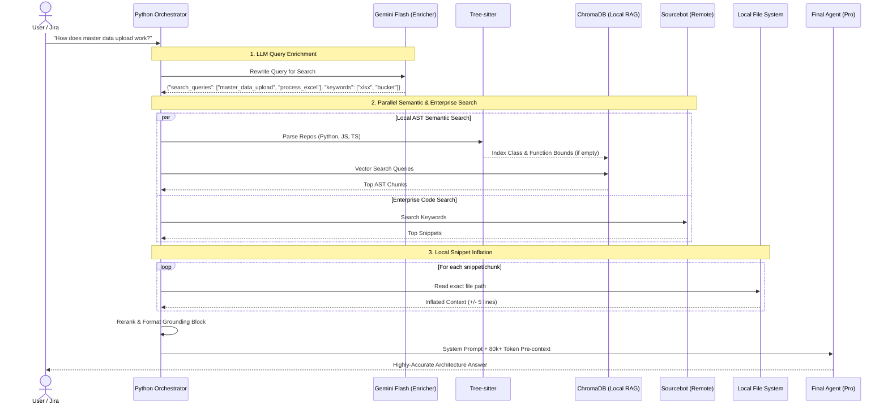

<div align="center">
  
  
  
  
  
  <h1>🚀 Tech Decomposition & Bulletproof Grounding</h1>
  <p><strong>An enterprise-grade, multi-repository AI coding assistant framework.</strong></p>
  <p>Turn natural language queries or Jira tickets into <b>highly-accurate technical decompositions</b> and architectural answers, powered by a custom "Bulletproof Grounding" pipeline that eliminates LLM hallucination across complex codebases.</p>
</div>

---

## 💡 The Problem

Standard LLM coding assistants (like Cursor, Cline, or Copilot) struggle when working in large enterprise environments. When you ask them to plan a feature or trace a bug, they:
- **Hallucinate APIs** because they assume standard web-framework patterns.
- **Fail at Multi-Repo Routing** because they only "see" one repository at a time.
- **Waste Time & Money** burning through dozens of blind `read_file` or `grep` tool calls trying to hunt down the right files.

## 🎯 The Solution: Bulletproof Grounding

We built an **SDK-Agnostic Pre-Context Engine** that forces the LLM to read the *exact, relevant code* across all your repositories simultaneously *before* it generates an answer.

Here is the exact flow of our pipeline:

1. 🧠 **LLM Query Enrichment:** A fast, cheap model (e.g., Gemini Flash) via `pydantic-ai` rewrites the user's messy question into a structured search query.
2. 🌳 **AST-Powered Repo Mapping:** We use **Tree-sitter** to parse the local workspace (Python, JS, TS, TSX). It maps every file to its specific `class_definition`, `function_declaration`, and React `component` signatures.
3. 🔎 **Local Semantic Indexing (Offline RAG):** 
   - We extract the exact byte-bounds of every AST function/class and embed them using **Hugging Face Sentence Transformers**.
   - These chunks are stored in a local, serverless **ChromaDB**. 
   - A semantic vector search instantly finds the exact code chunks related to the user's intent.
4. 🏢 **Enterprise Remote RAG:** We gracefully fallback/supplement to your internal **Sourcebot** instance if available.
5. 🎈 **Local Snippet Inflation:** Whenever a chunk is retrieved, the engine "inflates" it by reading 5 lines backwards and forwards from the OS, ensuring the AI sees surrounding imports and context.

**The result?** The engine concatenates this massive block of intelligence (often 80,000+ tokens) and prepends it to the LLM's prompt. **0 tool calls required. 100% architectural accuracy.**

---

## 🏗️ Architecture



### Components
1. **The `agent-node` (TypeScript):** A fast, isolated Node.js server leveraging the native Automatic Function Calling (AFC) capabilities of the AI SDKs (Google GenAI, OpenAI). Exposes OS-level workspace tools securely (`read_file`, `list_directory`, `search_files`, `grep_search`).
2. **The Python Orchestrator (`tech-decomposition`):** The primary backend managing user intents, Jira parsing, adapter routing, and the grounding pipeline.

---

## 🏆 Key Achievements

By shifting from a pure "reactive" agent (letting the LLM randomly use tools) to a "proactive" **Bulletproof Grounding Pipeline**, we achieved massive improvements:

- ✅ **Zero Hallucination Across Boundaries:** The agent no longer assumes standard web frameworks. It traces asynchronous pipelines across distributed microservices flawlessly.
- ✅ **Massive Token Ingestion (80k+ tokens):** Instead of making 15 expensive API calls line-by-line, the agent is pre-loaded with almost 100,000 tokens of highly-relevant, semantically ranked code chunks.
- ✅ **0 Tool Calls Required:** The agent solves complex architectural queries perfectly on the very first try.
- ✅ **Complete Offline Autonomy:** Fully local semantic understanding of the codebase without needing external Enterprise RAG indexing tools.

---

## 📊 Bake-off Framework

Don't guess which AI model or pipeline works best—prove it mathematically. We include a strict evaluation framework to run bake-offs between standard SDKs and the grounded pipeline.

```bash
# Run a specific test case against both the raw and grounded adapters
make eval-run ADAPTERS=gemini,gemini-grounded IDS=q1-data-sharing-geolocation
```

The system automatically measures: `Success Rate`, `Tokens In/Out`, `Cost (USD)`, `Duration`, and `Required Tool Calls`.

---

## 🛠️ Quick Start

### Prerequisites
- Python ≥ 3.11
- Node.js (for `agent-node`)
- `uv` (recommended Python package manager)
- [Docker](https://docs.docker.com/desktop/) (optional, for Sourcebot/Postgres/Redis)

### 1. Setup Environment
```bash
cp .env.example .env
# Add your AI API Keys (e.g. GEMINI_API_KEY)
```

### 2. Configure Your Proprietary Repositories
This framework is designed to search your private company repositories *without* ever committing them to this tool's codebase. 

Create a local folder (e.g., `repos/`, which is `.gitignore`d) and clone your company's repositories inside it:
```bash
mkdir repos
cd repos
git clone git@github.com:your-company/backend-api.git
git clone git@github.com:your-company/frontend-webapp.git
```
Then, update your `.env` file:
```env
REPOS_ROOT=./repos
REPOS=backend-api,frontend-webapp
```

### 3. Install & Run
```bash
# Install Python & Node Dependencies
make install
make ui-install

# Start the Stack (API, UI, Agent Node)
make dev-all
```

### 4. Execute
**Ask a question against your local codebases:**
```bash
make smoke
```

**Decompose a Jira Ticket (requires Jira API env vars):**
```bash
tech-decomposition --ticket-key SCRUM-17 --post-to-jira
```

---

## 📦 Directory Structure

```text
src/tech_decomposition/
├── adapters/
│   ├── _grounding.py         # The Bulletproof Grounding Engine
│   ├── _local_index.py       # ChromaDB + Sentence Transformers RAG
│   ├── _repo_map.py          # Tree-sitter AST parser
│   ├── registry.py           # Adapter registration mapping
│   └── _gemini.py            # SDK Implementation
├── api.py                    # FastAPI entrypoint
└── enrichers/                # LLM-powered query generators

services/agent-node/
├── src/adapters/
│   ├── gemini.ts             # Google GenAI SDK integration
│   └── workspace_tools.ts    # OS-level file operations (find, grep)

eval/                         # The bake-off evaluation framework
```
