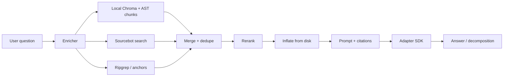
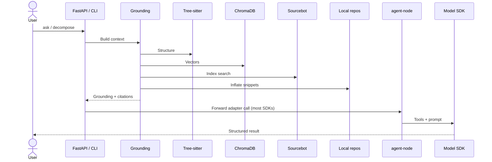

<div align="center">

  <!-- Badges -->
  <p>
    
    
    
    
  </p>
  <p>
    
    
    
    
    
  </p>

  <h1>Multi-repo code intelligence</h1>
  <p align="center"><strong>One API. Serious grounding. Your choice of model SDK.</strong></p>
  <p align="center" width="80%">
    Ask questions across <b>many repositories</b>, get answers backed by <b>real paths and citations</b>, and optionally <b>decompose</b> work into subtasks or <b>implement</b> via git—all through a <b>uniform adapter contract</b>. Grounding is <b>SDK-agnostic</b>: enrich → retrieve → rerank → inflate snippets, then hand a fat context block to Gemini, OpenAI Agents, Claude Code, Cursor, Cline, or Sourcebot chat.
  </p>
  <p align="center"><strong>Multi-repo · Local &amp; remote indexing · Grounded retrieval · Pluggable LLM SDKs</strong></p>

  <p>
    <a href="#what-we-support">Capabilities</a> ·
    <a href="#quick-start">Quick start</a> ·
    <a href="#adapters--sdks">Adapters</a> ·
    <a href="#grounding-engine">Grounding</a> ·
    <a href="#tools--retrieval">Tools</a> ·
    <a href="#stack--open-source">Stack</a> ·
    <a href="#http-api">API</a>
  </p>

</div>

---

## Why this exists

Most coding agents **guess** when they span repos. This stack **front-loads evidence**: structured query expansion, local semantic + lexical search, optional enterprise index (Sourcebot), and disk-backed snippet inflation so the model sees **actual code**, not vibes. You keep **integrations** (Jira, Slack, your portal) outside: they just `POST` JSON to the same routes.

---

## What we support

End-to-end capabilities you get out of the box (configure via `.env` and `config/`):

| Area | What you get |
|------|----------------|
| **Multi-repository** | One **repos root** (`REPOS_ROOT`) and a **repo list** (`REPOS`); all grounding, search, and adapters treat them as a single workspace. Mix backend, frontend, and data repos in one question. |
| **Indexing** | **Local:** AST-aware chunks embedded in **ChromaDB** (Sentence Transformers), built from your checkouts. **Remote / enterprise:** **Sourcebot** (Docker) indexes clones or mounts—zoekt-style code search + blocking chat API. Both can feed the same grounding pipeline. |
| **Languages** | **Tree-sitter** maps and chunks **Python**, **JavaScript**, **TypeScript**, **TSX** (extensible via more grammars). |
| **Grounded context** | Query enrichment (cheap LLM), semantic + lexical retrieval, **reranking**, **snippet inflation** from disk, typed **citations** (repo, path, lines). |
| **Agents & SDKs** | **Gemini**, **OpenAI Agents**, **Claude Code**, **Cursor**, **Cline** (via `agent-node`); **Sourcebot**-native Q&A from Python. Same HTTP shape for every adapter. |
| **Modes** | **`ask`** (Q&A), **`decompose`** (query → structured subtasks + markdown), **`implement`** (where the adapter supports it). |
| **Surfaces** | **REST** (FastAPI), **CLI** (`tech-decomposition` / `td`), **React UI** (Vite), **eval bake-offs** (`make eval-run`). |
| **Integrations** | No ticket/chat code in-repo—your **Jira / Slack / portal** calls the same JSON API; grounding and models stay centralized. |

---

## At a glance

| | |
|--|--|
| **Multi-repo** | Configure `REPOS_ROOT` + `REPOS`; Python + Tree-sitter + Chroma understand Python, JS, TS, TSX across all of them. |
| **Grounded by default** | Adapter `ask` paths use the grounding pipeline (enrichment, local index, Sourcebot, inflation, citations)—not a single vendor lock-in. |
| **Pluggable agents** | Swap `gemini` ↔ `openai_agents` ↔ `claude_code` ↔ `cursor` ↔ `cline_sdk` via HTTP; `ENABLED_ADAPTERS` to narrow the surface. |
| **Ship how you want** | FastAPI + bundled React UI, raw CLI, or curl from your own backend. |

---

## Adapters & SDKs

All adapters are registered in `src/tech_decomposition/adapters/registry.py`. Most **SDK-backed** adapters delegate to **`services/agent-node`** (Fastify + official JS SDKs); **`sourcebot`** is a Python adapter that talks to your Sourcebot HTTP API.

| Adapter | Runtime | SDK / backend | `ask` | `decompose` | `implement` |
|---------|---------|---------------|:-----:|:-----------:|:-----------:|
| **`gemini`** | Node (`agent-node`) | [`@google/genai`](https://www.npmjs.com/package/@google/genai) (AFC / tools) | ✅ | ✅ | ✅ |
| **`openai_agents`** | Node | [`@openai/agents`](https://github.com/openai/openai-agents-js) | ✅ | ✅ | ✅ |
| **`claude_code`** | Node | [`@anthropic-ai/claude-agent-sdk`](https://www.npmjs.com/package/@anthropic-ai/claude-agent-sdk) | ✅ | ✅ | ✅ |
| **`cursor`** | Node | [`@cursor/sdk`](https://www.npmjs.com/package/@cursor/sdk) | ✅ | ✅ | ✅ |
| **`cline_sdk`** | Node | [`@cline/sdk`](https://www.npmjs.com/package/@cline/sdk) | ✅ | ✅ | ✅ |
| **`sourcebot`** | Python | Sourcebot HTTP (`/api/chat/blocking`, search APIs) | ✅ | — | — |

Discover health and caps at runtime:

```http
GET /v1/adapters
```

---

## Grounding engine

**Bulletproof grounding** is the shared pre-context path: it does not replace your agent SDK—it **feeds** it.

<details>
<summary><b>Pipeline stages (click to expand)</b></summary>

1. **LLM query enrichment** — Cheap model via **pydantic-ai** produces `EnrichedQuery` (keywords, search queries, suspected repos, confidence).
2. **Repo map** — **Tree-sitter** walks Python / JS / TS / TSX for structural skeleton (symbols, components).
3. **Local semantic index** — **ChromaDB** + **Sentence Transformers**; AST-aware chunks, on-demand indexing under `.chroma_db` (see `.gitignore`).
4. **Sourcebot** (optional) — Indexed zoekt-style search over mounted or cloned repos.
5. **Lexical / anchor retrieval** — Ripgrep-style and anchor passes (file tokens, imports) as configured.
6. **Reranking** — Score fusion / rerank layer to tighten what enters the prompt.
7. **Snippet inflation** — Read surrounding lines from disk so chunks are not naked excerpts.
8. **Prompt assembly** — Grounding block + user question → adapter (`ask` / `decompose`).

Default adapter behavior uses **grounding=True** where applicable so answers lean on this path unless you opt out in code.

</details>



---

## Tools & retrieval

### Workspace tools (`agent-node`)

Sandboxed operations against the configured **repos root** (used by Gemini and friends via AFC):

| Tool | What it does |
|------|----------------|
| `read_file` | Read file contents within the workspace |
| `list_directory` | List directory entries |
| `search_files` | Find files by name / pattern (`find`-style) |
| `grep_search` | Ripgrep-style content search |

### Retrieval & indexing (Python orchestrator)

| Mechanism | Role |
|-----------|------|
| **Sourcebot retriever** | HTTP search + chat blocking API |
| **Local semantic index** | Chroma + embeddings over Tree-sitter chunks |
| **Repo map** | Structural map per repo |
| **Anchors / import follow** | Ticket/query-derived file focus (where enabled) |
| **Serena MCP** (optional Docker profile) | LSP-backed exploration for deep / experimental flows |

### Product surfaces

| Surface | Tech |
|---------|------|
| **REST API** | FastAPI — `/v1/adapters/{name}/ask\|decompose\|implement` |
| **CLI** | `tech-decomposition` / `td` — `ask`, `decompose`, `serve`, `history`, … |
| **Web UI** | React 18, Vite, Tailwind 4, DaisyUI — Q&A + history + adapter bake-off |
| **Eval** | `make eval-run` — TOML + YAML cases, JSON + `report.md` |

---

## Architecture



### Repos layout

| Area | Responsibility |
|------|----------------|
| `src/tech_decomposition/` | API, CLI, **adapters**, engines, retrievers, enrichers |
| `services/agent-node/` | Fastify, **Gemini / OpenAI / Claude / Cursor / Cline**, workspace tools |
| `web/` | Vite + React UI |
| `eval/` | Bake-off runner, cases, outputs |

---

## Stack & open-source

**Languages:** Python 3.11+, TypeScript (strict), modern CSS.

**Orchestration:** [FastAPI](https://github.com/tiangolo/fastapi), [Uvicorn](https://github.com/encode/uvicorn), [Pydantic v2](https://github.com/pydantic/pydantic), [pydantic-ai](https://github.com/pydantic/pydantic-ai), [httpx](https://github.com/encode/httpx), [Rich](https://github.com/Textualize/rich).

**Code intelligence:** [Tree-sitter](https://tree-sitter.github.io/tree-sitter/) (+ grammars for Python, JavaScript, TypeScript), [ChromaDB](https://github.com/chroma-core/chroma), [sentence-transformers](https://github.com/UKPLab/sentence-transformers), [grep-ast](https://github.com/paul-gauthier/grep-ast), OS `grep` / `find`.

**Agent sidecar:** [Fastify](https://github.com/fastify/fastify), [Zod](https://github.com/colinhacks/zod), [@google/genai](https://www.npmjs.com/package/@google/genai), [@openai/agents](https://github.com/openai/openai-agents-js), Anthropic SDKs, [@modelcontextprotocol/sdk](https://github.com/modelcontextprotocol/typescript-sdk), Cursor & Cline SDKs.

**UI:** [React](https://react.dev/) 18, [Vite](https://vitejs.dev/), [Tailwind CSS](https://tailwindcss.com/) 4, [DaisyUI](https://daisyui.com/), [react-markdown](https://github.com/remarkjs/react-markdown).

**Infra (Compose):** [Sourcebot](https://github.com/sourcebot-dev/sourcebot), PostgreSQL 16, Redis 8; optional [Serena](https://github.com/oraios/serena) (LSP MCP).

**Packaging:** [uv](https://github.com/astral-sh/uv), [Hatchling](https://github.com/pypa/hatch).

**Dev:** [pytest](https://pytest.org/), [Ruff](https://github.com/astral-sh/ruff).

LLM **APIs** (Gemini, OpenAI, Anthropic) are cloud services; you supply keys via `.env`.

---

## HTTP API

| Method | Path | Purpose |
|--------|------|---------|
| `GET` | `/health` | Liveness |
| `GET` | `/v1/adapters` | List adapters, capabilities, health |
| `POST` | `/v1/adapters/{name}/ask` | Code Q&A with grounding |
| `POST` | `/v1/adapters/{name}/decompose` | Query → structured decomposition |
| `POST` | `/v1/adapters/{name}/implement` | Implement subtask (when supported) |
| `POST` | `/v1/bakeoff/{job}` | `job` = `ask` · `decompose` · `implement` — run same input across adapters |
| `GET` | `/runs`, `/runs/{id}` | History |
| `POST` | `/runs/{id}/replay` | Replay stored payload |

Built UI: `/ui` when `web/dist` exists or `UI_DIST_DIR` points at a build.

---

## CLI

```bash
tech-decomposition ask "How does auth flow from UI to API?"
tech-decomposition decompose --query "Unicode-safe farm name validation" --mode auto
tech-decomposition serve --host 127.0.0.1 --port 8000
```

Short alias: **`td`**.

---

## Evaluation

```bash
make eval-adapters
make eval-cases                              # optional: JOB=ask|decompose|implement
make eval-run ADAPTERS=gemini JOB=ask
make eval-run ADAPTERS=gemini,openai_agents JOB=decompose
```

Artifacts: `eval/outputs/eval-<timestamp>/` → `report.md`, `summary.json`, per-run JSON.

---

## Quick start

**Prereqs:** Python ≥ 3.11, [uv](https://github.com/astral-sh/uv), Node 22+ (for UI + agent-node), Docker optional.

```bash
cp .env.example .env
# GEMINI_API_KEY, OPENAI_API_KEY, ANTHROPIC_API_KEY, etc. as needed
```

Point at local clones (ignored by git, e.g. `repos/`):

```env
REPOS_ROOT=./repos
REPOS=backend-api,frontend-webapp
```

```bash
make install && make ui-install
make dev-all          # Docker: Postgres, Redis, Sourcebot; host: API + Vite
# or: make up         # full stack in Docker
```

**Smoke:**

```bash
curl -sS "http://localhost:${API_PORT:-18000}/v1/adapters/${ADAPTER:-gemini}/ask" \
  -H 'content-type: application/json' \
  -d '{"query":"Where is the suppliers list rendered?"}' | python -m json.tool
```

---

## Directory structure

```text
src/tech_decomposition/
├── api.py                    # FastAPI
├── cli.py
├── adapters/                 # registry, grounding, local index, repo map, SDK bridges
├── engines/                  # ask, decompose, deep paths
├── retrievers/               # sourcebot, ripgrep, anchors, …
└── enrichers/

services/agent-node/          # Fastify + Google / OpenAI / Anthropic / Cursor / Cline

web/                          # Vite + React + Tailwind + DaisyUI

eval/
├── bakeoff/
├── cases/
└── questions.toml

config/sourcebot/             # Sourcebot config template
```

---

<p align="center"><sub>Built for teams who want <strong>one honest context layer</strong> and <strong>many ways to talk to it</strong>.</sub></p>
