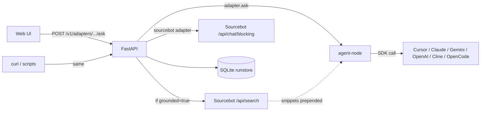

<div align="center">

  <p>
    
    
    
    
    
  </p>
  <p>
    
    
    
    
    
    
    
  </p>

  <h1>tech-decomposition</h1>
  <p align="center">
    One JSON API. Seven code-AI backends. Two modes (ask, decompose).<br/>
    Optional grounded retrieval. A web UI to drive both.
  </p>

  <p>
    <a href="#what-it-is">What it is</a> ·
    <a href="#adapters">Adapters</a> ·
    <a href="#http-api">HTTP API</a> ·
    <a href="#grounded-retrieval-opt-in">Grounding</a> ·
    <a href="#web-ui">UI</a> ·
    <a href="#quick-start">Quick start</a>
  </p>

</div>

---

## What it is

A thin **uniform contract** over a handful of code-AI tools — Claude Code, Cursor, Cline, Gemini, OpenAI Agents, OpenCode, and Sourcebot. Same JSON request shape, same response shape, regardless of which one runs it. Two modes:

- **`ask`** — code Q&A. The adapter explores the workspace (each SDK uses its own tools) and answers.
- **`decompose`** — turn a ticket / task into a typed `Decomposition`: overview, affected repos, subtasks (with files + acceptance criteria), risks, open questions.

You drive it via FastAPI (`/v1/adapters/{name}/{ask,decompose}`) or the bundled React UI. Swap adapters per request. Run the same input through several at once (`/v1/bakeoff/{job}`) and compare. Optionally pre-fetch Sourcebot-indexed snippets as a grounding step.

That's the whole project. Nothing else hides under the hood.

---

## Adapters

Registered in `src/tech_decomposition/adapters/registry.py`. Most SDK-backed adapters run inside `services/agent-node` (Node, Fastify) — the Python side is a thin HTTP client. `sourcebot` is the exception: it's a Python adapter that talks directly to Sourcebot's chat API.

| Adapter | Backend | Runtime | Capabilities |
|---|---|---|---|
| **`sourcebot`** | Sourcebot `/api/chat/blocking` | Python | `ask` |
| **`claude_code`** | [`@anthropic-ai/claude-agent-sdk`](https://www.npmjs.com/package/@anthropic-ai/claude-agent-sdk) | Node | `ask`, `decompose` |
| **`cursor`** | [`@cursor/sdk`](https://www.npmjs.com/package/@cursor/sdk) | Node | `ask`, `decompose` |
| **`cline_sdk`** | [`@cline/sdk`](https://www.npmjs.com/package/@cline/sdk) | Node | `ask`, `decompose` |
| **`gemini`** | [`@google/genai`](https://www.npmjs.com/package/@google/genai) | Node | `ask`, `decompose` |
| **`openai_agents`** | [`@openai/agents`](https://github.com/openai/openai-agents-js) | Node | `ask`, `decompose` |
| **`opencode`** | [`@opencode-ai/sdk`](https://opencode.ai/) | Node | `ask`, `decompose` |

Each Node-side adapter exposes the SDK's own workspace tools (`read_file`, `list_directory`, `grep_search`, `search_files`) so its agent can explore your local clones at `REPOS_ROOT`.

Discover what's installed + healthy at runtime:

```http
GET /v1/adapters
```

---

## HTTP API

| Method | Path | Purpose |
|---|---|---|
| `GET` | `/health` | Liveness |
| `GET` | `/v1/adapters` | List adapters, capabilities, health |
| `POST` | `/v1/adapters/{name}/ask` | Code Q&A through one adapter |
| `POST` | `/v1/adapters/{name}/decompose` | Ticket → `Decomposition` |
| `POST` | `/v1/grounding/retrieve` | Sourcebot search alone — see snippets + metrics |
| `POST` | `/v1/bakeoff/{job}` | `ask`\|`decompose` — fan one input across N adapters |
| `GET` | `/runs`, `/runs/{id}` | History list / detail |
| `POST` | `/runs/{id}/replay` | Re-run a saved request |

**Request example (ask, grounded):**

```bash
curl -sS http://localhost:18000/v1/adapters/cursor/ask \
  -H 'content-type: application/json' \
  -d '{"query":"how does upload master data work?","grounded":true}' \
  | jq '{adapter: .result.adapter, snippets: (.result.grounding.snippets|length), tokens: .result.metrics.tokens_in}'
```

**Response shape (ask):**

```json
{
  "run_id": "ab12...",
  "thread_id": "ab12...",
  "result": {
    "adapter": "cursor",
    "answer": "...",
    "citations": [],
    "metrics": { "tokens_in": 8200, "tokens_out": 410, "duration_ms": 7400, "model": "composer-2", ... },
    "grounding": {
      "snippets": [{ "repo": "...", "path": "...", "start_line": 23, "end_line": 47, "content": "...", "url": "..." }],
      "grounding_block": "## Relevant code (grounded retrieval)\n...",
      "metrics": { "duration_ms": 850, "snippet_count": 6, "total_chars": 14200, "sources": ["sourcebot"], "sourcebot_files_seen": 6 }
    }
  }
}
```

`result.grounding` is only present when the request set `grounded: true`.

---

## Grounded retrieval (opt-in)

Grounding is a **single composable step**, not a default. You ask for it per request:

- **As a standalone call**: `POST /v1/grounding/retrieve` returns the snippets, the rendered markdown block, and timing/char metrics — no LLM call. Useful to see *what* grounding produces and *what it costs* before deciding to inject it.
- **As a flag on ask**: `POST /v1/adapters/{name}/ask` with `{"grounded": true}` runs the same retrieval, prepends the block to the user prompt, then calls the adapter. The adapter's `metrics` (tokens/cost) and `grounding.metrics` (latency/snippets/chars) are reported separately so you can compare grounded vs not on the same question.

V1 uses Sourcebot's `/api/search` as the only retrieval source. Configure Sourcebot's `config.json` `models` array to pick the LLM Sourcebot's agent uses (we default to OpenAI gpt-4.1 — see `config/sourcebot/config.json`).

What grounding does **not** include (vs. the v0 pipeline that was removed):

- No ChromaDB / Sentence Transformers local index
- No tree-sitter repo map / structural prelude
- No LLM query enrichment hop
- No reranker

Reason: each SDK adapter has its own retrieval inside its agent loop (Cursor/Claude/Gemini all use their own `read_file`/`grep_search`/`list_directory` tools). Re-running our own retrieval on top of that adds latency without proportional gain. Grounding is here for the **Sourcebot case** — where a centrally-indexed snippet block helps an SDK that's running in a single repo see cross-repo context — and as an opt-in everywhere else.

---

## Web UI

A React + Tailwind + DaisyUI single-page app under [`web/`](web/). Two tabs:

- **Ask** — chat-style threaded conversation. Pick adapter, optionally toggle **Grounded**, send. The answer card shows the meta strip (model, wall, tokens, cost), the markdown answer, citations, and (when grounded) a collapsible grounding panel that lists each injected snippet inline.
- **Decompose** — single-shot ticket → structured `Decomposition`. Renders subtasks as cards (title, repo, complexity badge, files with optional Sourcebot URLs, acceptance criteria) plus collapsible risks / open questions, with raw markdown tucked at the bottom.

History sidebar covers both modes. Click any prior run to see its details (including its grounding payload if it had one).

```bash
cd web && npm install && npm run dev   # → http://localhost:15173, vite proxies API to :18000
```

For prod the UI is bundled with `npm run build`; FastAPI serves `web/dist/` at `/ui` when present.

---

## Architecture



Grounding (the dashed line) is the only "extra" step. Without it, the path is straight: API → adapter → LLM → response → save to runstore → return.

---

## Repo layout

```text
src/tech_decomposition/
├── adapters/            # 7 adapters + registry + Decomposition prompt helpers
├── clients/sourcebot.py # Sourcebot HTTP client (chat/blocking + answer-style suffix)
├── core/
│   ├── context.py       # RunContext (per-request state)
│   ├── runstore.py      # SQLite-backed run history + replay
│   ├── grounding.py     # GroundedContext + retrieve_grounded_context()
│   ├── llm_registry.py  # model spec → pydantic-ai model (for any in-process LLM use)
│   └── usage.py         # token-usage extraction
├── api.py               # FastAPI surface
├── analyze.py           # log analyzer CLI (entry: tech-decomposition-analyze)
├── config.py            # Settings (env-driven)
└── models.py            # Decomposition, Subtask, Snippet, Ticket, EnrichedQuery

services/agent-node/     # Fastify + JS SDKs for Claude / Cursor / Cline / Gemini / OpenAI Agents / OpenCode
web/                     # Vite + React + Tailwind + DaisyUI
eval/                    # Bake-off: TOML/YAML cases, runner, scorer, report (eval/bakeoff)
config/sourcebot/        # config.json — Sourcebot's models + connectors
```

---

## Stack

**Python:** FastAPI, Uvicorn, Pydantic v2, pydantic-ai, httpx, Rich, uv (packaging).

**Node:** Fastify, Zod, official JS SDKs (`@google/genai`, `@openai/agents`, `@anthropic-ai/claude-agent-sdk`, `@cursor/sdk`, `@cline/sdk`, `@opencode-ai/sdk`).

**Web:** React 18, Vite, Tailwind 4, DaisyUI, react-markdown + remark-gfm.

**Infra (Compose):** Sourcebot, PostgreSQL 16, Redis 8.

---

## Quick start

**Prereqs:** Python 3.11+, [uv](https://github.com/astral-sh/uv), Node 22+, Docker (for the Sourcebot stack).

```bash
cp .env.example .env
# Fill in:
#   At least one provider key (OPENAI_API_KEY / ANTHROPIC_API_KEY / GEMINI_API_KEY).
#   SOURCEBOT_AUTH_SECRET + SOURCEBOT_ENCRYPTION_KEY (openssl rand -base64 ...).
#   After first start: SOURCEBOT_API_KEY (from Sourcebot UI → Settings → API Keys).
```

Point Sourcebot at local clones:

```env
REPOS_ROOT=./repos
REPOS=backend-api,frontend-webapp
```

```bash
make install && make ui-install
make dev-all            # Docker: Postgres + Redis + Sourcebot. Host: FastAPI + Vite + agent-node.
# or: make up           # everything in Docker (uses bundled UI)
```

Smoke test:

```bash
curl -sS http://localhost:18000/health
curl -sS http://localhost:18000/v1/adapters | jq '.adapters[] | {name, health}'
```

Open the UI at `http://localhost:${UI_PORT:-15173}` (dev) or `http://localhost:${API_PORT:-18000}/ui` (built).

---

## Evaluation

A small bake-off runner under [`eval/`](eval/) — fan a TOML/YAML case set across one or more adapters, score with simple rule checks, write a markdown report.

```bash
make eval-adapters                              # show registered adapters + health
make eval-cases                                 # list discovered cases (JOB=ask|decompose)
make eval-run ADAPTERS=cursor JOB=ask
make eval-run ADAPTERS=gemini,openai_agents JOB=decompose
```

Output: `eval/outputs/eval-<timestamp>/report.md` + `summary.json` + per-run JSON.

---

## Observability

- **Run history:** every API call is persisted in `outputs/runstore.db` (SQLite). The UI sidebar reads from `/runs`; full detail at `/runs/{id}`.
- **Metrics digest:** `uv run tech-decomposition-analyze --since 24h` summarizes recent runs by adapter / cost / wall.

---

<p align="center"><sub>One uniform contract. Many code-AI backends. Bring your own keys.</sub></p>
